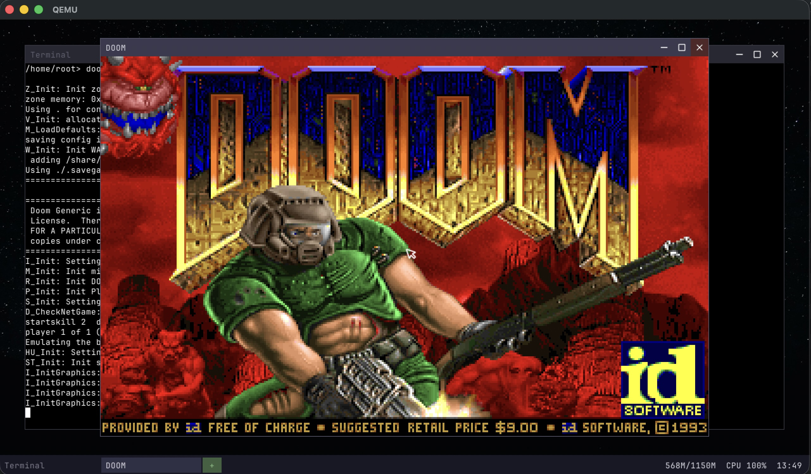

# ToyOS

A custom OS with bootloader, kernel, and userland built from scratch in Rust.

## Current milestones

**Self-hosting the Rust compiler** -- Getting `rustc` to compile and run inside ToyOS, building Rust programs from within the OS itself.

**Running Doom** -- Doom (doomgeneric) runs natively on ToyOS with the custom compositor, software rendering, keyboard input, and sound.



## Prerequisites

- QEMU
- Rust (with rustup)

## How to run

```
cargo run
```

This automatically initializes git submodules, bootstraps the custom Rust toolchain (on first run), builds the kernel, bootloader, and userland, then launches QEMU.

Subsequent runs detect changes and only rebuild what's needed. Std-only changes rebuild in ~8 seconds.
