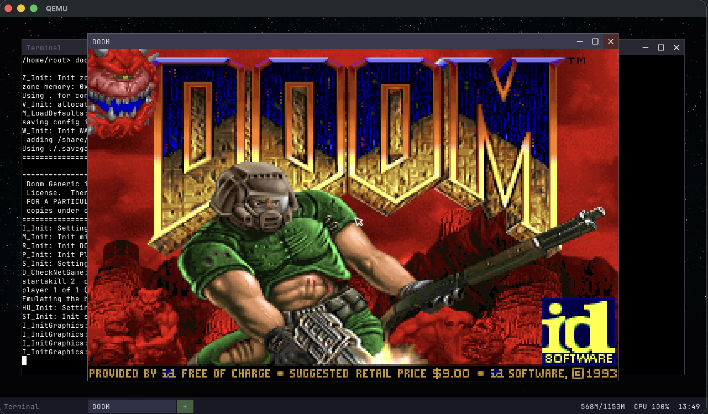
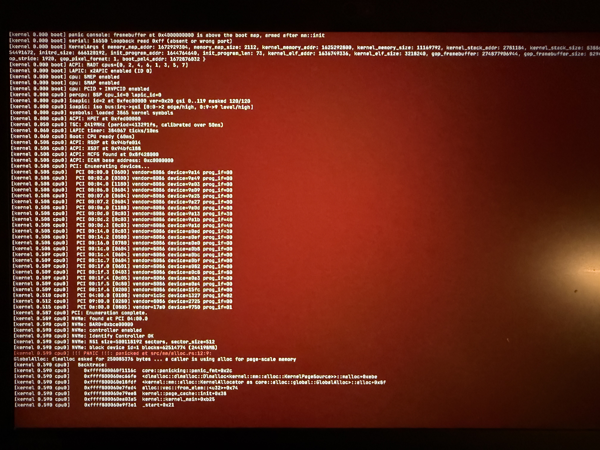

# ToyOS

A custom OS with bootloader, kernel, and userland built from scratch in Rust.

## Current milestones

**Self-hosting the Rust compiler** -- Getting `rustc` to compile and run inside ToyOS, building Rust programs from within the OS itself.

**Running Doom** -- Doom (doomgeneric) runs natively on ToyOS with the custom compositor, software rendering, keyboard input, and sound.



**Booting on real hardware** -- the very first boot on a physical machine, from a USB stick on a ThinkPad T14 Gen 2. It reached CPU bring-up, x2APIC, I/O APIC, ACPI, full PCI enumeration and NVMe identification in 590 ms on the first attempt.

The screenshot is the laptop's own panel: the machine has no serial port, so the kernel renders its log and panics to the framebuffer. It is reporting a real bug -- the page cache sized an index from the disk's block count, which fit in QEMU's 1 GiB test image and wanted 238 MB on a 244 GB drive.



## Along the way

**Our own C compiler** -- `toyos-cc` is 9,964 lines of Rust: preprocessor, lexer, parser, type system, and Cranelift rather than LLVM as its backend. It compiles the 82 platform-independent translation units of doomgeneric -- 56,726 lines of C descended from id Software's Doom -- into `x86_64-unknown-toyos` objects in about four seconds, and that archive is the `/bin/doom` in the desktop image. It also takes 83 cases from TinyCC's own `tests2` corpus all the way to running ToyOS processes, comparing each one's output against TinyCC's expectations.

**Our own linker** -- `toyos-ld` is 6,501 lines and links everything that runs on ToyOS, plus everything that runs before it: the UEFI bootloader as PE32+, the kernel and all 17 userland programs as position-independent ELF. No LLVM linker touches anything that boots. The largest thing it lays out is `librustc_driver` -- the Rust compiler itself, built for ToyOS -- at 200 MB in a single shared object.

**A real Rust target** -- `x86_64-unknown-toyos` lives in ToyOS's fork of the compiler, with a prebuilt `std` in the sysroot. One `rustc` invocation turns an ordinary program using `HashMap`, threads and `println!` into a ToyOS binary. Threads, thread-locals across `dlopen`, `catch_unwind`, `Drop` during unwind, and backtraces symbolized to demangled names all work. The port is under 3,600 lines and changes nothing in `core` or `alloc`.

**The Rust ecosystem, mostly unmodified** -- the default boot image links 170 third-party crates compiled for ToyOS, 158 of them exactly as published. Doom opens its window through `winit`, presents frames through `softbuffer`, and plays through `cpal`; its music is General MIDI rendered by `rustysynth` against a 6 MB SoundFont. The twelve crates that needed patches live as `toyos` branches of their own repositories, never vendored.

**Reading the stick it booted from** -- on the ThinkPad, ToyOS's own xHCI and USB mass-storage drivers enumerate the SanDisk stick UEFI booted it from, parse its GPT, and mount both FAT32 partitions. The running kernel then appends its log to a file on that stick, through its own FAT32 write path, so a machine with no serial port can be read on any other computer afterwards. The GPT parser is `no_std`, allocation-free and `forbid(unsafe_code)`, and answers only one question: where is the partition with this GUID.

**A test suite that boots the OS 250 times in two minutes** -- `cargo test` builds the toolchain, kernel, bootloader and initrd, then runs 248 tests across twelve concurrent QEMU guests in 108 seconds. Roughly twenty distinct machine shapes exist because device *shape* is what finds bugs: a device that is absent, one enumerated in a hostile order, a 4Kn disk, two identical controllers, a port that flaps. The audio gate compares captured device output against a recorded baseline statistically, and the panic-console tests decode the framebuffer glyph by glyph against the same font the kernel blits.

## Prerequisites

- QEMU
- Rust (with rustup)

## How to run

```
cargo run
```

This automatically initializes git submodules, bootstraps the custom Rust toolchain (on first run), builds the kernel, bootloader, and userland, then launches QEMU.

Subsequent runs detect changes and only rebuild what's needed. Std-only changes rebuild in ~8 seconds.

## License

Licensed under either of

- Apache License, Version 2.0 ([LICENSE-APACHE](LICENSE-APACHE))
- MIT license ([LICENSE-MIT](LICENSE-MIT))

at your option.

Two exceptions: `userland/doom` links [doomgeneric](https://github.com/ozkl/doomgeneric) and is therefore GPL-2.0, and the third-party crates vendored under `userland/` keep their own upstream licenses.

Unless you explicitly state otherwise, any contribution intentionally submitted for inclusion in this project shall be dual licensed as above, without any additional terms or conditions. No CLA.
